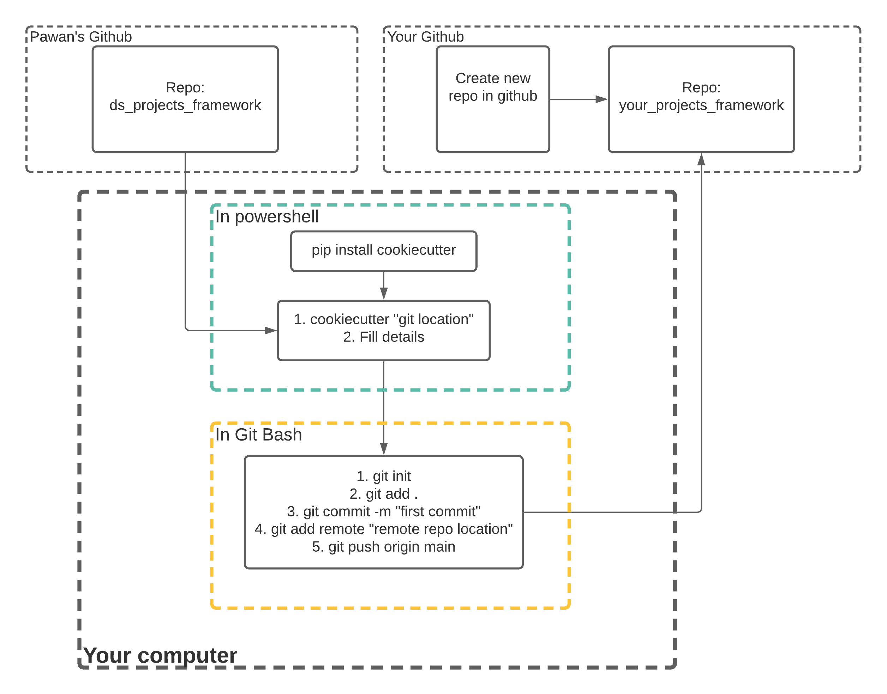

# Data Science projects frame work for Colaberry Data Science Program 

The is framework uses cookiecutter to generate data science projects framework
for Colaberry Data Science course. 

## Getting Started 
To Get started with this project template, follow the steps that are outlined below: 

1) Install Cookiecutter using pip or conda
2) Start a project using cookiecutter
3) Visual guide to deploy the framework


### Requirements to use the cookiecutter template:
-----------
 - Python 2.7 or 3.5
 - [Cookiecutter Python package](http://cookiecutter.readthedocs.org/en/latest/installation.html) >= 1.4.0: This can be installed with pip by or conda depending on how you manage your Python packages:


### Install Cookiecutter using pip or conda
------------

``` bash
$ pip install cookiecutter
```

or

``` bash
$ conda config --add channels conda-forge
$ conda install cookiecutter
```

### Start a Project using cookiecutter 
------------
To start a project using cookiecutter run the following code in Anaconda Prompt or Windows Powershell

    cookiecutter https://github.com/pawan-nandakishore/ds_projects_framework


### The resulting directory structure
------------

The directory structure of your new project looks like this: 

```
├── LICENSE
├── Makefile           <- Makefile with commands like `make data` or `make train`
├── README.md          <- The top-level README for developers using this project.
├── data
│   ├── external       <- Data from third party sources.
│   ├── interim        <- Intermediate data that has been transformed.
│   ├── processed      <- The final, canonical data sets for modeling.
│   └── raw            <- The original, immutable data dump.
│
├── docs               <- A default Sphinx project; see sphinx-doc.org for details
│
├── models             <- Trained and serialized models, model predictions, or model summaries
│
├── notebooks          <- Jupyter notebooks. Naming convention is a number (for ordering),
│                         the creator's initials, and a short `-` delimited description, e.g.
│                         `1.0-jqp-initial-data-exploration`.
│
├── references         <- Data dictionaries, manuals, and all other explanatory materials.
│
├── reports            <- Generated analysis as HTML, PDF, LaTeX, etc.
│   └── figures        <- Generated graphics and figures to be used in reporting
│
├── requirements.txt   <- The requirements file for reproducing the analysis environment, e.g.
│                         generated with `pip freeze > requirements.txt`
│
├── src                <- Source code for use in this project.
    ├── __init__.py    <- Makes src a Python module
    │
    ├── data           <- Scripts to download or generate data
    │   └── make_dataset.py
    │
    ├── features       <- Scripts to turn raw data into features for modeling
    │   └── build_features.py
    │
    ├── models         <- Scripts to train models and then use trained models to make
    │   │                 predictions
    │   ├── predict_model.py
    │   └── train_model.py
    │
    └── visualization  <- Scripts to create exploratory and results oriented visualizations
        └── visualize.py


```


### Visual guide on how to deploy the framework
In order to deploy this framework to your own github repo, here is a visual guide of what you need to do. 

####  Notes:
1) Rather than Windows Powershell, you may have to use Anaconda Prompt to work install cookiecutter and locally pull the framework. 

2) Make sure you create the github repo on github before you run 
cookicutter https://github.com/pawan-nandakishore/ds_projects_framework. 
This makes sure you have a github repo https address at hand that you can add to the repo directly. 




## Cookiecutter Data Science Projects 

A project framework based on the [Cookiecutter data science](http://drivendata.github.io/cookiecutter-data-science/)


### Installing development requirements
------------

    pip install -r requirements.txt


# Here are some Data sources

There are multiple ways you can source data for the problem. 

Here are some places to get data from: 

- Data.world(https://data.world/)
- Data is Plural (https://tinyletter.com/data-is-plural/archive)
- US Government Data (https://www.data.gov/)
- World Data AI (World Data | Predictability Models Powered by WorldData.AI)
- UCI Datasets(https://archive.ics.uci.edu/ml/datasets.php)
- BigML(https://bigml.com/)
